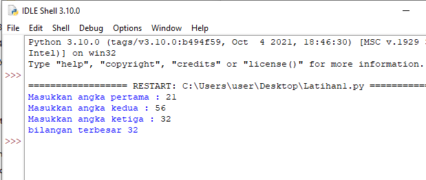

# Labspy02
### Tutorial Mencari Bilangan Terbesar Diantara 3 Bilangan

Input int a, b dan c setelah itu gunakan statetment if jika a lebih besar dari b atau lebih besar dari c <i> print a</i> jika b lebih besar a atau b lebih besar c <i>print b</i> dan terakhir gunakan else <i>print c</i> dan output program seperti gambar dibawah.

### end